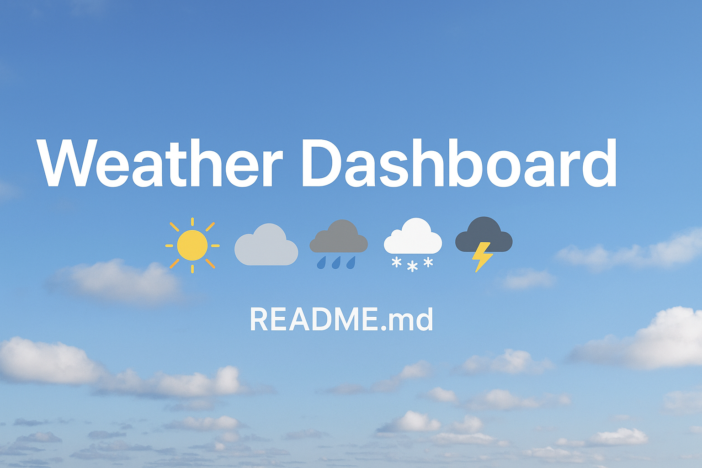
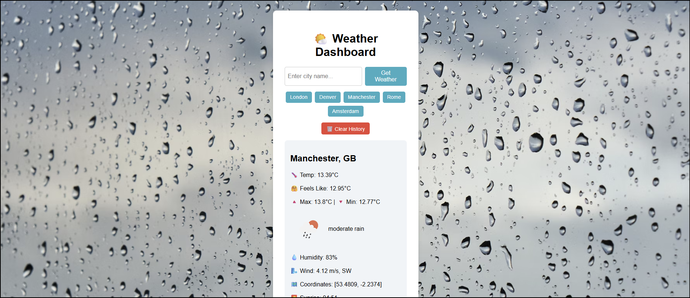

# 🌦️ Weather Dashboard

A fully responsive and interactive weather application that allows users to search for real-time weather data and a 5-day forecast for any city worldwide. Built using **HTML**, **CSS**, and **JavaScript**, and powered by the **OpenWeatherMap API**.

---

## 🚀 Features

- 🔍 **City Search** – Enter any city to view live weather information.
- 🌡️ **Current Weather Data** – Temperature, humidity, feels-like, sunrise/sunset, wind, and more.
- 📆 **5-Day Forecast** – Displayed using visually styled cards at midday intervals.
- 🎨 **Dynamic Backgrounds** – Changes based on the weather condition (e.g., Rain, Snow, Clear).
- ♻️ **Search History** – Buttons appear for recent searches using localStorage.
- 🧹 **Clear History** – Remove previous searches with one click.
- 🌀 **Loading Spinner** – Enhances UX while fetching data.
- 📱 **Mobile Responsive** – Optimised for all screen sizes.

---

## 🛠 Tech Stack

- **HTML5**
- **CSS3**
- **Vanilla JavaScript**
- [OpenWeatherMap API](https://openweathermap.org/api)
- [Unsplash Backgrounds](https://unsplash.com)

---

## 📂 Project Structure

```
weather-dashboard/
├── index.html        # Markup structure
├── style.css         # Styling and layout
├── script.js         # Core JavaScript functionality
└── README.md         # Project overview
```

---

## 📸 Screenshots

### 🔹 Current Weather + Background


### 🔹 5-Day Forecast in Action


## 📦 Setup Instructions

1. Clone this repository:
   ```bash
   git clone https://github.com/yourusername/weather-dashboard.git
   cd weather-dashboard
   ```

2. Open `index.html` directly in your browser **or** use Live Server via VS Code.

3. Replace the `API_KEY` in `script.js` with your own from [OpenWeatherMap](https://openweathermap.org/api).

---

## 🔐 API Key Setup

Inside `script.js`, replace the placeholder with your real API key:

```js
const API_KEY = "YOUR_OPENWEATHERMAP_API_KEY";
```

---

## 💡 Educational Goals

This project demonstrates:

- Consuming external APIs with `fetch()`
- DOM manipulation and event handling
- State management using localStorage
- Responsive layout using vanilla CSS
- Clean and maintainable code with reusable functions

---

## 📚 Future Improvements

- Unit conversion (°C to °F)
- Geo-location-based weather on load
- Night mode toggle
- Deployment via GitHub Pages

---

## 👨‍💻 Author

**Mark Brough**  
📎 [GitHub Profile](https://github.com/M-S-Brough)

---

> 🔖 _“A clean and functional frontend project, built to impress and ready to extend.”_
